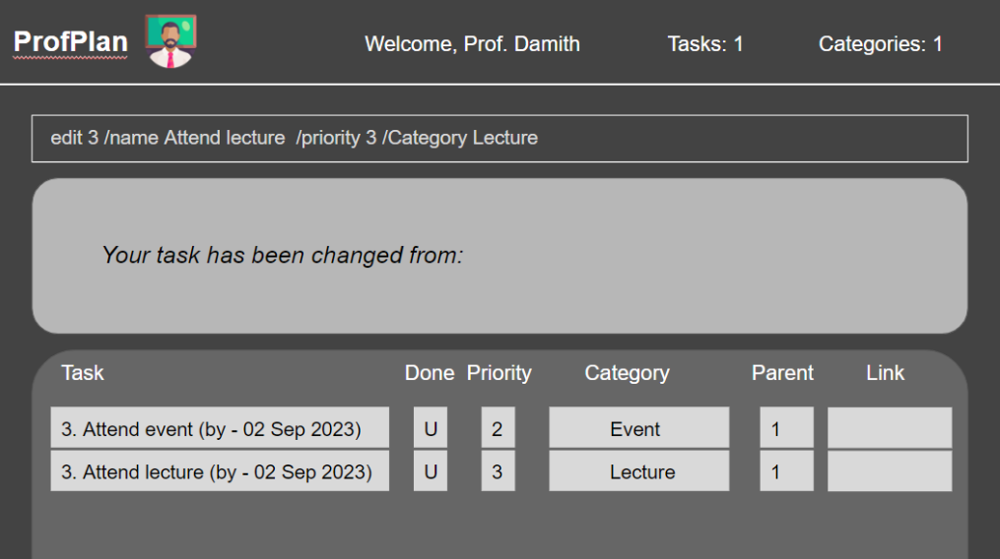

AddressBook Level 3 (AB3) is a **desktop app for managing contacts, optimized for use via a Command Line Interface** (CLI) while still having the benefits of a Graphical User Interface (GUI). If you can type fast, AB3 can get your contact management tasks done faster than traditional GUI apps.

* Table of Contents
{:toc}

--------------------------------------------------------------------------------------------------------------------

## Quick start

1. Ensure you have Java `11` or above installed in your Computer.

1. Download the latest `addressbook.jar` from [here](https://github.com/se-edu/addressbook-level3/releases).

1. Copy the file to the folder you want to use as the _home folder_ for your AddressBook.

1. Open a command terminal, `cd` into the folder you put the jar file in, and use the `java -jar addressbook.jar` command to run the application. 
   A GUI similar to the below should appear in a few seconds. Note how the app contains some sample data. 
   

1. Type the command in the command box and press Enter to execute it. e.g. typing **`help`** and pressing Enter will open the help window. 
   Some example commands you can try:

   * `list` : Lists all contacts.

   * `add n/John Doe p/98765432 e/johnd@example.com a/John street, block 123, #01-01` : Adds a contact named `John Doe` to the Address Book.

   * `delete 3` : Deletes the 3rd contact shown in the current list.

   * `clear` : Deletes all contacts.

   * `exit` : Exits the app.

1. Refer to the [Features](#features) below for details of each command.

--------------------------------------------------------------------------------------------------------------------

## Features

**:information_source: Notes about the command format:** 

* Words in `UPPER_CASE` are the parameters to be supplied by the user. 
  e.g. in `add n/NAME`, `NAME` is a parameter which can be used as `add n/John Doe`.

* Items in square brackets are optional. 
  e.g `n/NAME [t/TAG]` can be used as `n/John Doe t/friend` or as `n/John Doe`.

* Items with `…`​ after them can be used multiple times including zero times. 
  e.g. `[t/TAG]…​` can be used as ` ` (i.e. 0 times), `t/friend`, `t/friend t/family` etc.

* Parameters can be in any order. 
  e.g. if the command specifies `n/NAME p/PHONE_NUMBER`, `p/PHONE_NUMBER n/NAME` is also acceptable.

* Extraneous parameters for commands that do not take in parameters (such as `help`, `list`, `exit` and `clear`) will be ignored. 
  e.g. if the command specifies `help 123`, it will be interpreted as `help`.

* If you are using a PDF version of this document, be careful when copying and pasting commands that span multiple lines as space characters surrounding line-breaks may be omitted when copied over to the application.

### Editing a person : `edit`

Edit the aspects of selected existing task, as specified by the user.

Format: `edit [index] /[aspect] [newValue] /[aspect] [newValue]…`

* Edits the task at the specified `[index]`. The index refers to the index number shown in the displayed tasks list. The index **must be a positive integer** 1, 2, 3, …​
* [aspect] **must be a string**, and be one of the following:  `name`, `priority`, `category`, `parent`, or `link`.
* [newValue] **must be a string**.
* Existing values will be updated to the input values.

Examples:
*  `edit 2 /name Updated task /priority 3` Edits the task name and priority of the 2nd task, to be `Updated task` and `3` respectively.
*  `edit 4 /parent 3 /link www.google.com` Edits the parent and link of the 4th task to be `3` and `www.google.com` respectively.
    

### Filtering tasks by date: `filter`

Filters the relevant tasks by their due dates. User can input a date, after which tasks that fall before the date is displayed.

Format: `filter /[type] [date]`

* The filter will return all tasks that fall before, and in the specified month or year.
* [type] **must be a string**, and be one of the following: `month`, or `year`.
* [date] **must be a positive integer**, of the form `mm`, if [type] is `month`.
* [date] **must be a positive integer**, of the form `yyyy`, if [type] is `year`.

Examples:
* `filter /month 09`
* `filter /year 2023` 
  

--------------------------------------------------------------------------------------------------------------------

## Command summary

Action | Format, Examples
--------|------------------

**Edit** | `edit [index] /[aspect] [newValue] /[aspect] [newValue]…​`  e.g.,`edit 2 /name Updated task /priority 3`
**Filter** | `filter /[type] [date]`  e.g., `filter /month 09`

