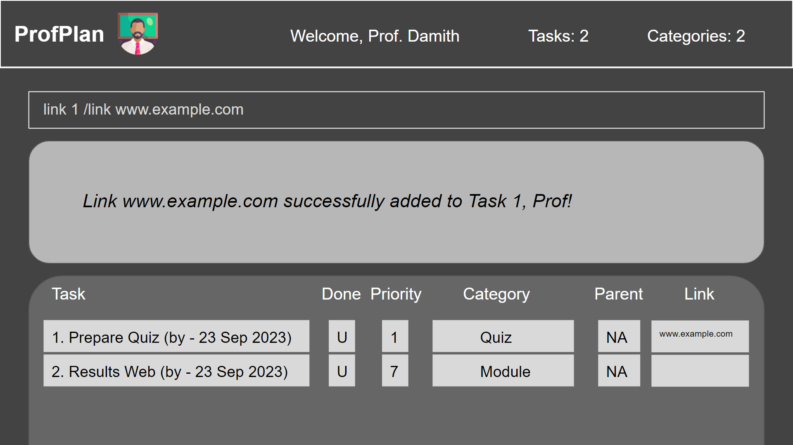
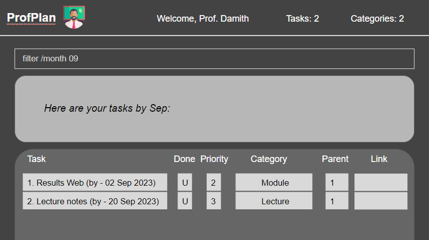

ProfPlan is a **desktop app for managing tasks, optimized for use via a Command Line Interface** (CLI) while still 
having the benefits of a Graphical User Interface (GUI). If you can type fast, ProfPlan can get your task management 
done faster than traditional GUI apps.

* Table of Contents
{:toc}

--------------------------------------------------------------------------------------------------------------------

## Quick start

1. Ensure you have Java `11` or above installed in your Computer.

1. Download the latest `profplan.jar` from [here](https://github.com/AY2324S1-CS2103T-W15-1/tp/releases).

1. Copy the file to the folder you want to use as the _home folder_ for ProfPlan.

1. Open a command terminal, `cd` into the folder you put the jar file in, and use the `java -jar profplan.jar` 
   command to run the application. 
   A GUI similar to the below should appear in a few seconds. Note how the app contains some sample data. 
   

1. Type the command in the command box and press Enter to execute it. 
   Some example commands you can try:

   * `list` : Lists all tasks.

   * `todo set finals /by 02 Nov 2023`: Adds a task titled `set finals` to the task list.

   * `delete 3` : Deletes the 3rd task shown in the current list.

   * `exit` : Exits the app.

1. Refer to the [Features](#features) below for details of each command.

--------------------------------------------------------------------------------------------------------------------

## Features

**:information_source: Notes about the command format:** 

* Words in square brackets are the parameters to be supplied by the user. 
  e.g. in `task [taskToDo] /by [deadline]`, `taskToDo` and `deadline` are parameters which can be used as `add n/John 
  Doe`.

* Items in braces are optional. 

* Items with `…` after them can accept multiple parameters. If these items are in braces, they can be used 0 times 
  as well. 
  e.g. `[keywords…]` can be used as `quiz`, `mock midterm` etc.

* Extraneous parameters for commands that do not take in parameters (such as `help`, `list`, `exit` and `clear`) will be ignored. 
  e.g. if the command specifies `help 123`, it will be interpreted as `help`.

* If you are using a PDF version of this document, be careful when copying and pasting commands that span multiple lines as space characters surrounding line-breaks may be omitted when copied over to the application.

### Categorising a task: `categorise`

Puts the task in a category of the task list. If the category specified does not yet exist, it will be created. 

Format: `categorise [taskNumber] /cat [category]​`

* Categorises the task at the specified [taskNumber]. The [taskNumber] refers to the [taskNumber] number shown in the displayed tasks list. The [taskNumber] must be a positive integer 1, 2, 3, … 
* [category] must be a string.
* Existing values will be updated to the input values.

Examples:
* `categorise 2 /cat quiz` Categorises the 2nd task into the `category` quiz.
  

### Attach links or references to a task: `link`

Attach a URL or external link to the task.

Format: ` link [taskNumber] /link [URL]​`

* Attaches the specified [link] to the task at the specified [taskNumber]. The [taskNumber] refers to the [taskNumber] number shown in the displayed tasks list. The [taskNumber] must be a positive integer 1, 2, 3, … 
* [link] must be a string.
* Existing values will be updated to the input values.

Examples:
* `link 1 /link www.example.com` Attaches the link `www.example.com` to the 1st task.
  

### Saving the data

ProfPlan data are saved in the hard disk automatically after any command that changes the data. There is no need to save manually.

### Editing the data file

ProfPlan data are saved automatically as a JSON file `[JAR file location]/data/ProfPlan.json`. Advanced users are welcome to update data directly by editing that data file.

:exclamation: **Caution:**
If your changes to the data file makes its format invalid, ProfPlan will discard all data and start with an empty data file at the next run. Hence, it is recommended to take a backup of the file before editing it.

--------------------------------------------------------------------------------------------------------------------

## FAQ

**Q**: How do I transfer my data to another Computer? 
**A**: Install the app in the other computer and overwrite the empty data file it creates with the file that contains the data of your previous AddressBook home folder.

--------------------------------------------------------------------------------------------------------------------

## Known issues

1. **When using multiple screens**, if you move the application to a secondary screen, and later switch to using only the primary screen, the GUI will open off-screen. The remedy is to delete the `preferences.json` file created by the application before running the application again.
=======
Edit the aspects of selected existing task, as specified by the user.

Format: `edit [index] /[aspect] [newValue] /[aspect] [newValue]…`

* Edits the task at the specified `[index]`. The index refers to the index number shown in the displayed tasks list. The index **must be a positive integer** 1, 2, 3, …​
* [aspect] **must be a string**, and be one of the following:  `name`, `priority`, `category`, `parent`, or `link`.
* [newValue] **must be a string**.
* Existing values will be updated to the input values.

Examples:
*  `edit 2 /name Updated task /priority 3` Edits the task name and priority of the 2nd task, to be `Updated task` and `3` respectively.
*  `edit 4 /parent 3 /link www.google.com` Edits the parent and link of the 4th task to be `3` and `www.google.com` respectively.
    

### Filtering tasks by date: `filter`

Filters the relevant tasks by their due dates. User can input a date, after which tasks that fall before the date is displayed.

Format: `filter /[type] [date]`

* The filter will return all tasks that fall before, and in the specified month or year.
* [type] **must be a string**, and be one of the following: `month`, or `year`.
* [date] **must be a positive integer**, of the form `mm`, if [type] is `month`.
* [date] **must be a positive integer**, of the form `yyyy`, if [type] is `year`.

Examples:
* `filter /month 09`
* `filter /year 2023` 
  

--------------------------------------------------------------------------------------------------------------------

## Command summary

Action | Format, Examples
--------|------------------

**Edit** | `edit [index] /[aspect] [newValue] /[aspect] [newValue]…​`  e.g.,`edit 2 /name Updated task /priority 3`
**Filter** | `filter /[type] [date]`  e.g., `filter /month 09`

